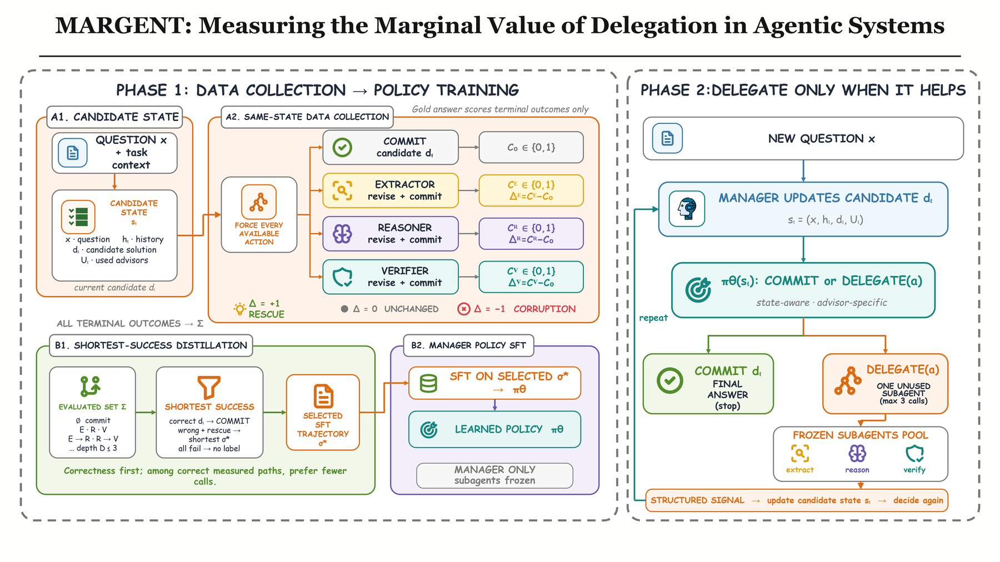

# MARGENT: Measuring the Marginal Value of Delegation in Agentic Systems

[](https://github.com/Candy26i/MARGENT/actions/workflows/tests.yml)
[](LICENSE)
[](requirements.txt)

Supplementary code for the paper (under review).
**Project page and experiment report:** https://candy26i.github.io/MARGENT/

A trainable manager LLM answers multiple-choice reasoning questions. At every
turn it either **commits** its current candidate solution or **delegates** to
one unused frozen sub-agent (Extractor, Reasoner or Verifier), revises the
candidate from the returned structured signal, and decides again. MARGENT
measures the marginal value of each delegation by branching from the *same*
manager-generated state into immediate commitment and every available
delegation, scores the terminal branches with the gold answer, and distills the
shortest successful branch into supervised trajectories for the manager. Only
the manager is fine-tuned; sub-agents stay frozen and never emit an answer.



## Terminology: paper vs. code

The code predates the paper's final vocabulary. The mapping below applies throughout.

| Paper | Code / CLI |
|---|---|
| sub-agent | advisor, `subagent`, `agent_kind` ∈ {`extractor`, `reasoner`, `verifier`} |
| candidate solution ŷ_t | `DRAFT_ANSWER_<X>` line; `initial_draft` in evaluation rows |
| commit | final `ANSWER_<X>` line |
| same-state interventional collection, search depth D | `build_marginal_sft`, `--mv_max_depth {1,2,3}` |
| marginal value Δ(s, a) = C(delegate) − C(commit); rescue / corruption | `rescue_rate`, `corruption_rate`, `net_marginal_rate` in `marginal_value_report.json` |
| shortest-successful-path selection (Eq. 3–4) | `choose_preferred_sequence` in `src/manager/marginal_value.py` |
| commit-to-rescue ratio ρ | `--mv_max_commit_rescue_ratio` (0 = rescues only, −1 = keep every commit) |
| marginal-value distillation (manager SFT) | `train_manager_sft` on `manager_sft_marginal.jsonl` |
| learned delegate-or-commit policy evaluation | `eval_manager_tools` |
| forced one Verifier call / force all three | `eval_manager_forced --eval_forced_tools verifier` / `extractor,reasoner,verifier` |
| call gap (P(call \| candidate wrong) − P(call \| candidate correct)) | `draft_conditioned_call_gap` in the evaluation report |

## Method in brief

1. **Interventional collection.** For each training question a temperature-0
   manager produces a candidate without delegation. From that shared root the
   collector forces direct commitment and delegation to each sub-agent,
   breadth-first over ordered sequences of distinct sub-agents up to depth D,
   stopping at the first depth with a successful sequence (all equally short
   successes are kept). Directly correct roots are expanded one step only, for
   corruption analysis. The gold answer scores terminal branches and is never
   shown to any model.
2. **Distillation.** Correct candidate → commit target. Incorrect candidate with
   a successful branch → one shortest success sampled with an example-specific
   seed. No successful branch → no label. Commit trajectories are capped at ρ
   times the rescue trajectories. The manager is LoRA-fine-tuned
   (`--sft_no_lora` for full-parameter) on the resulting per-state decisions.

Sub-agents return schema-constrained JSON (pydantic) and are filtered at
synthesis by JSON, schema, coverage and answer-leakage gates
(`--synth_symmetric_leakage`). They are greedy-decoded and cached per complete
input, so the Verifier's cache key includes the candidate it audits.

## Repository layout

```
src/
  benchmarks/   MedQA, MMLU-Pro, GPQA and AQuA-RAT loaders -> StandardRow
  teachers/     OpenAI / Anthropic / DeepSeek clients for sub-agent data synthesis
  subagents/    sub-agent prompts, pydantic schemas, synthesis, LoRA SFT, runtime
  manager/      prompt protocol (prompt.py), interventional collection + distillation
                data (marginal_value.py), manager SFT (sft.py), tool-call
                normalisation and chat rendering (chat_template.py)
  pipeline/     cli.py (single entry point); stage implementations in data.py,
                subagent_stages.py, manager_stages.py and eval_stages.py;
                context.py (output layout under outputs/<teacher_id>)
  utils/        jsonl I/O, caching, leakage audit, seeding
scripts/        vLLM sub-agent server, GPQA split builder
tests/          unit tests for the selection rule, chat rendering and the
                AQuA-RAT loader (no GPU, no torch)
docs/
  EXPERIMENTS.md  step-by-step protocol with gates and ablations
  figures/        overview figure
```

The outcome-only GRPO continuation of the paper's Appendix D and the earlier
cold-start/reward-shaping code are on the `legacy` branch, tag `v0.1-full`,
and are not maintained.

## Installation

```bash
python -m venv .venv && source .venv/bin/activate
pip install -r requirements.txt

# separate environment for the vLLM sub-agent server
conda create -n vllm_env python=3.11 -y && conda activate vllm_env && pip install vllm

export OPENAI_API_KEY=...      # or ANTHROPIC_API_KEY / DEEPSEEK_API_KEY (synthesis only)
export PYTHONUTF8=1
```

GPU 0 serves the base model plus the three LoRA sub-agents through vLLM; the
collector, SFT and evaluation run on another GPU. The paper's manager
checkpoint is `Qwen/Qwen3.5-9B` with LoRA sub-agents on the same base model;
the walkthrough below uses that id (`Qwen/Qwen3-8B` also runs unchanged).

## Data

No dataset files are redistributed. Loaders download and normalise each
benchmark into `outputs/data/*.jsonl`:

| Benchmark | Stage | Notes |
|---|---|---|
| MedQA-USMLE (4 options) | `load_medqa` | official train/dev/test splits |
| MMLU-Pro | `load_mmlu_pro` | `--mmlu_pro_splits test` |
| GPQA | `load_gpqa`, `scripts/build_gpqa_splits.py` | gated: accept the terms on Hugging Face and `huggingface-cli login`; the split script holds out 100 Diamond questions, disjoint from the 446-question collection pool |
| AQuA-RAT | `load_aqua_rat` | `--aqua_rat_splits test` (default): the 254-question test split used in the paper (n = 254); `--aqua_rat_splits train` for its collection pool; `deepmind/aqua_rat`, config `raw` |

## Reproducing the pipeline (MedQA walkthrough)

Every stage goes through `python -m src.pipeline.cli <stage>`; `--teacher_id`
namespaces all outputs under `outputs/`. `docs/EXPERIMENTS.md` has the
complete protocol with go/no-go gates.

```bash
export BASE_MODEL=Qwen/Qwen3.5-9B        # the paper's manager checkpoint; Qwen/Qwen3-8B also works
export TEACHER_ID=medqa_mv
export PROVIDER=openai MODEL=gpt-4o
export MEDQA_CACHE=outputs/data/medqa_us4_normalized.jsonl
export TASK_DESC="You are a manager agent solving a medical multiple-choice question."
export SPLIT="--train_size 1400 --dev_size 200 --test_size 500"
export SUBAGENT_SERVER_URL=http://localhost:8000

# 1) data
python -m src.pipeline.cli load_medqa --base_model "$BASE_MODEL" \
    --medqa_normalized_cache "$MEDQA_CACHE" $SPLIT

# 2) synthesise sub-agent SFT data (JSON, schema, coverage and leakage gates)
for KIND in extractor reasoner verifier; do
  python -m src.pipeline.cli synth_subagent \
      --base_model "$BASE_MODEL" --teacher_id "$TEACHER_ID" \
      --teacher_provider "$PROVIDER" --teacher_model "$MODEL" \
      --agent_kind "$KIND" --n_samples 500 --synth_symmetric_leakage \
      --medqa_normalized_cache "$MEDQA_CACHE" $SPLIT --task_description "$TASK_DESC"
done

# 3) LoRA-SFT the three sub-agents, then gate on JSON/schema validity
for KIND in extractor reasoner verifier; do
  python -m src.pipeline.cli train_subagent \
      --base_model "$BASE_MODEL" --teacher_id "$TEACHER_ID" --agent_kind "$KIND" \
      --sft_epochs 3 --sft_lr 5e-5 --sft_bs 1 --sft_grad_accum 8
done
python -m src.pipeline.cli eval_subagents --base_model "$BASE_MODEL" \
    --teacher_id "$TEACHER_ID" --medqa_normalized_cache "$MEDQA_CACHE" $SPLIT --eval_n_samples 100

# 4) terminal A, GPU 0: serve the frozen sub-agents (keep running)
conda activate vllm_env
bash scripts/start_subagent_server.sh "$BASE_MODEL" "$TEACHER_ID"

# 5) terminal B: interventional collection, disjoint from the sub-agent SFT questions
export CUDA_VISIBLE_DEVICES=1
EXCL_ADVISOR_SFT="--exclude_sft_example_ids outputs/sft_data/${TEACHER_ID}/extractor_sft.jsonl \
  --exclude_sft_example_ids outputs/sft_data/${TEACHER_ID}/reasoner_sft.jsonl \
  --exclude_sft_example_ids outputs/sft_data/${TEACHER_ID}/verifier_sft.jsonl"
python -m src.pipeline.cli build_marginal_sft \
    --base_model "$BASE_MODEL" --teacher_id "$TEACHER_ID" \
    --medqa_normalized_cache "$MEDQA_CACHE" $SPLIT $EXCL_ADVISOR_SFT \
    --mv_manager_dir "$BASE_MODEL" --mv_n_samples 400 --mv_max_depth 3 \
    --mv_max_commit_rescue_ratio 1.0 --mv_temperature 0 \
    --subagent_server_url "$SUBAGENT_SERVER_URL" --task_description "$TASK_DESC"
# -> outputs/manager/$TEACHER_ID/marginal_value/{counterfactual_records,counterfactual_branches,
#    manager_sft_marginal}.jsonl and marginal_value_report.json (oracle accuracy by depth,
#    rescue/corruption per sub-agent)

# 6) marginal-value distillation: SFT the manager on the selected decisions
python -m src.pipeline.cli train_manager_sft \
    --base_model "$BASE_MODEL" --teacher_id "$TEACHER_ID" \
    --manager_sft_train_jsonl "outputs/manager/${TEACHER_ID}/marginal_value/manager_sft_marginal.jsonl" \
    --manager_sft_output_dir "outputs/manager/${TEACHER_ID}/sft_marginal" \
    --manager_sft_epochs 1 --manager_sft_lr 1e-5

# 7) evaluate the learned policy on held-out questions
python -m src.pipeline.cli eval_manager_tools \
    --base_model "$BASE_MODEL" --teacher_id "$TEACHER_ID" \
    --medqa_normalized_cache "$MEDQA_CACHE" $SPLIT --eval_n_samples 500 \
    --eval_manager_dir "outputs/manager/${TEACHER_ID}/sft_marginal" \
    --eval_max_tool_calls 3 \
    --subagent_server_url "$SUBAGENT_SERVER_URL" --task_description "$TASK_DESC"
# report: accuracy, initial_draft_accuracy (the "candidate" column), avg_tool_calls,
#         draft_conditioned_call_gap, correction_rate, corruption_rate

# 8) fixed-sequence baselines with the same manager and sub-agent pool
for SEQ in verifier "extractor,reasoner,verifier"; do
  python -m src.pipeline.cli eval_manager_forced \
      --base_model "$BASE_MODEL" --teacher_id "$TEACHER_ID" \
      --medqa_normalized_cache "$MEDQA_CACHE" $SPLIT --eval_n_samples 500 \
      --eval_manager_dir "outputs/manager/${TEACHER_ID}/sft_marginal" \
      --eval_forced_tools "$SEQ" \
      --subagent_server_url "$SUBAGENT_SERVER_URL" --task_description "$TASK_DESC"
done
```

**Commit-to-rescue sweep.** Re-run step 5 with `--mv_max_commit_rescue_ratio`
in `0 0.5 1 2 3` (and `-1` to keep every commit), writing each collection to
its own `--mv_output_dir`, then repeat steps 6–7. Larger ρ lowers the call rate
and usually raises the call gap; select ρ, depth and checkpoint on the
development pool before the single locked evaluation.

MMLU-Pro, GPQA and AQuA-RAT each get their own collection and manager with
the same steps, their cache flags and a matching `--task_description`; the
paper searches to depth 3 on MedQA and AQuA-RAT and to depth 2 on MMLU-Pro and
GPQA (`docs/EXPERIMENTS.md` §9).

## Pipeline stages

| Stage | Purpose |
|---|---|
| `load_medqa` / `load_mmlu_pro` / `load_gpqa` / `load_aqua_rat` | download and normalise benchmarks |
| `synth_subagent` | teacher synthesis of sub-agent SFT data with quality gates |
| `export_deepseek_jsonl` / `import_deepseek_jsonl` | offline-teacher alternative to `synth_subagent` |
| `train_subagent` | LoRA-SFT one sub-agent |
| `eval_subagents` | JSON / schema validity gate for sub-agents |
| `build_marginal_sft` | same-state interventional collection and shortest-success selection |
| `train_manager_sft` | manager distillation (or continuation from a checkpoint with `--manager_sft_init_adapter`); saves `manager_run_config.json` (the tool-binding wording) next to the checkpoint |
| `eval_manager_tools` | the learned delegate-or-commit policy |
| `eval_manager_forced` | fixed delegation sequences: always-Verifier, force-all, any subset |

Defaults: `train_manager_sft` reads `marginal_value/manager_sft_marginal.jsonl`
and writes `sft_marginal/` under `outputs/manager/<teacher_id>/`;
`eval_manager_tools` and `eval_manager_forced` default `--eval_manager_dir` to
that `sft_marginal/` directory and also accept a full checkpoint directory or a
Hugging Face id.

## Tests

```bash
python -m unittest discover -s tests -t . -v
```

## Citation

The paper is under review. Until it is public, please cite the repository:

```bibtex
@misc{margent2026,
  title  = {MARGENT: Measuring the Marginal Value of Delegation in Agentic Systems},
  author = {Anonymous},
  year   = {2026},
  note   = {Under review. Code: https://github.com/Candy26i/MARGENT}
}
```

## License

MIT (see `LICENSE`). Benchmarks keep their own licenses and terms of use.
